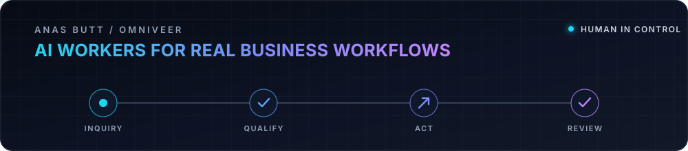

  <strong>Founder of <a href="https://www.omniveer.com">Omniveer</a> · AI Engineer · Full-stack builder</strong> 
  I design AI agents that do useful work, connect with real operations, and keep people in control.  
  <a href="https://www.omniveer.com">Omniveer</a> ·
  <a href="https://www.omniveer.com/duct-lead-qualifier">Flagship product</a> ·
  <a href="https://github.com/anusbutt?tab=repositories">Repositories</a>

## Building now

**[Omniveer](https://www.omniveer.com)** builds, deploys, and manages specialized AI workers for real businesses.

Its flagship product, **[Duct Lead Qualifier](https://www.omniveer.com/duct-lead-qualifier)**, handles inbound conversations for duct-cleaning businesses: it qualifies leads, captures details, emails qualified opportunities, and keeps the full conversation available for human review.

## Selected builds

- **[Agent Replay](https://github.com/anusbutt/agent-replay)** — Record, inspect, and safely fork failed AI-agent runs.
- **[Prospector](https://github.com/anusbutt/Prospector)** — Research-backed outreach drafts with approval-only sending.
- **[Commit Voice](https://github.com/anusbutt/commit-voice)** — Turn GitHub activity into reviewable social posts.

## Stack

**AI systems:** OpenAI Agents SDK · RAG · chatbots · workflow automation 
**Product:** Python · TypeScript · FastAPI · Next.js · React · PostgreSQL · Supabase

> Have a real workflow that should become an AI worker? **[Start with Omniveer →](https://www.omniveer.com)**

<!-- LinkedIn company page placeholder: add the verified Omniveer URL here when available. -->
